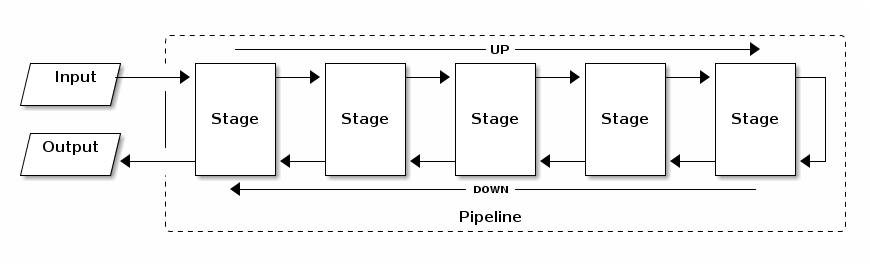
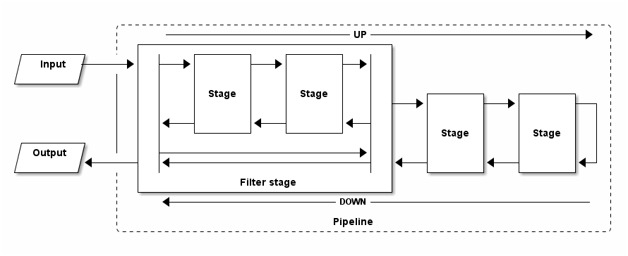
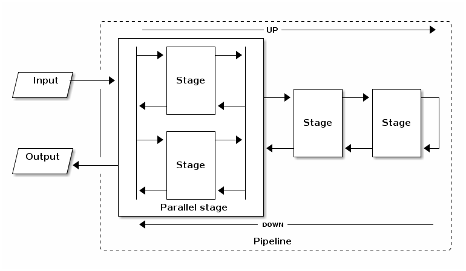

[](https://travis-ci.org/sandhje/j-stillery)

# JStillery
A Javascript / Typescript implementation of the pipeline (a.k.a. pipes and filters) pattern.

The pipeline pattern is used for algorithms in which data flows through a sequence of stages each performing some operation and then passing the (potentionally modified) input on to the next stage in the pipeline.

The basic idea of this pattern is much like the idea of an assembly line. For example, suppose the goal is to manufacture a number of cars, where the manufacture process of each car can be separated into a sequence of smaller operations (e.g., installing a windshield). Then we can set up an assembly line (pipeline), with each operation assigned to a different worker. As the car-to-be moves down the assembly line, it is built up by performing the sequence of operations; each worker, however, performs the same operation over and over on a succession of cars.

JStillery is a flexible bi-directional pipeline, giving each stage control over when the next stage in the pipeline should be called and therefore giving it two possibilities to perform its operations: before the next stage runs and after that stage completes. These two interaction points are called the "up" and "down" process of the stage, derived from the travelling direction of the payload through the pipeline.



## Installation

Install with npm:

```
npm install open-sourcerers/j-stillery
```

## Requirements

- Node version 4 or higher
- Any ES-5 compliant browser

## Basic usage example
Below a basic example of setting up a pipeline with, in this case, two stages (the tasks).

### Typescript

```typescript
import { Pipeline, Task } from "@open-sourcerers/j-stillery";

// Payload for pipeline
// Can be anything, in this case an instance of the fictive class "Car"
let car = new Car();

// Some operations to be performed by the pipeline
// This Task only "does" something in its up process
let windshieldTask = new Task<Car>((input: Car, resolve, reject) => {
    input.installWindshield(); // input is the Car instance here
    resolve(input); // Resolve the task once done
});

// This Task does something in its up and down processes
let wheelsTask = new Task<Car>((input: Car, resolve, reject)) => {
    // You can also do something async in the task
    input.installWheels().then(() => {
        resolve(input); // Resolve once the asyn operation is done.
    }, (reason) => {
        reject(reason); // Reject if something went wrong in the task, cancelling the pipeline.
    });
}, (input: Car, resolve, reject) => {
    // Do something in the down process
    input.alignWheels();
    resolve(input);
});

// Instantiate and configure the pipeline
let pipeline = (new Pipeline<Car>()).pipe(winshieldTask).pipe(wheelsTask);

// Run the pipeline with some payload and do something with it's result
pipeline.run(car).then((result: Car) => {
    // Completed car
}, (reason: any) {
    // Something went wrong
})

```
### Javascript
```javascript
var JStillery = require("@open-sourcerers/j-stillery");

// Payload for pipeline
// Can be anything, in this case an instance of the fictive class "Car"
let car = new Car();

// Some operations to be performed by the pipeline
// This Task only "does" something in its up process
var windshieldTask = new JStillery.Task(function (input, resolve, reject) {
    input.installWindshield(); // input is the Car instance here
    resolve(input); // Resolve the task once done
});

// This Task does something in its up and down processes
let wheelsTask = new Task(function (input, resolve, reject)) => {
    // You can also do something async in the task
    input.installWheels().then(function () {
        resolve(input); // Resolve once the asyn operation is done.
    }, function (reason) {
        reject(reason); // Reject if something went wrong in the task, cancelling the pipeline.
    });
}, function (input, resolve, reject) => {
    // Do something in the down process
    input.alignWheels();
    resolve(input);
});

// Instantiate and configure the pipeline
var pipeline = (new JStillery.Pipeline()).pipe(winshieldTask).pipe(wheelsTask);

// Run the pipeline with some payload and do something with it's result
pipeline.run(car).then(function (result) => {
    // Completed car
}, (reason) {
    // Something went wrong
})

```

## Stages

Each "step" in a JStillery pipeline is called a stage and should implement the IStage interface. JStillery comes shipped with three types of stages:

- *Task* - A stage specifically set up to perform actions on the input it receives.
- *Filter* - A stage designed to invoke "sub-stages" conditionally.
- *Parallel* - A stage designed to invoke "sub-stages" in parallel.

### Task

The Task is the most "basic" of the three types of stages available in JStillery. The Task takes two arguments of type IExecutableStrategy or IExecutableCallback. The first "executable" passed will be run immediatly when the stage is invoked (the stage's "up" process). Once the executable has resolved the next stage in the pipeline will be called by the Task. Immediatly after the next stage resolves the second "executable" passed upon construction will be run (the stage's "down" process). Once that executable has resolved the Task stage resolves allowing the preceding stage in the pipeline to execute its "down" process.

See the basic usage example for an example of how to use a Task stage with an IExecutableCallback.

#### IExecutableStrategy

A class can implement the IExecutableStrategy interface by defining a public "execute" method which takes three arguments:

- *input* - The payload.
- *resolve* - A callable that should be called with the (modified) payload as it's first argument once the "work" is done.
- *reject* - A callable that should be called with a reason for failure if the "work" failed.

#### IExecutableCallback

A callable taking the three parameters of the IExecutableStrategy's "execute" method.

### Filter

The Filter is a wrapper stage upon which "sub-stages" can be piped. The "sub-stages" will form a "sub-pipeline" within the "main" JStillery pipeline. This "sub-pipeline" will only be executed if the filter's conditions are met. These conditions are defined by passing an IMatchStrategy or IMatchCallback into the filter's constructor.



### IMatchStrategy

A class can implement the IMatchStrategy interface by defining a public "match" method which takes one argument:

- *input* - The payload.

The "match" method should return a truthy value if the "sub-pipeline" should be run. 

### IMatchCallback

A callable taking the same parameters as the IMatchStrategy's "match" method. As the IMatchStrategy's "match" method, this callable is also expected to return a truthy value if the "sub-pipeline" should be run.

### Parallel

The Parallel is, as the Filter, a wrapper stage upon which "sub-stages" can be piped. All of the "sub-stages" will be called in parallel instead of in sequence once the Parallel stage is invoked. This may improve performance if many async calls need to be made that are not dependent on each others result. The "up" process of the parallel stage resolves once all "sub-stages" resolve their "up" process. After all "sub-stages" have resolved their "up" process a merge needs to be done to make sure following stages in the pipeline deal with the correct result from the various "sub-stages". After the merge is complete the next stage in the pipeline is called. The same happens for the "down" process. Once all of the "sub-stages" have "resolved" their "down" process another merge needs to be done, after which the preceding stage in the pipeline can continue with its "down" process.

The merging logic for both the "up" and "down" processes can be passed using the two arguments of the Parallel's constructor. These arguments need to implement the IMergeStrategy or the IMergeCallback.



### IMergeStrategy

A class can implement the IMergeStrategy interface by defining a public "merge" method which takes two arguments:

- *input* - The original input of the Parallel stage.
- *results* - An array of results from the various parallel executed stages.

The "merge" method should return the merged result, which will then be sent to the next stage.

### IMergeCallback   

A callable taking the same parameters as the IMergeStrategy's "merge" method. As the IMergeStrategy's "merge" method, this callable is also expected to return the merged result, which will then be sent to the next stage.

### Creating your own stage type

By implementing the IStage interface you can easily create your own type of stage. The IStage interface defines the "invoke" method which is used by the pipeline to invoke the stage. The invoke method takes four parameters:

- *input* - The payload
- *next* - A callable that needs to be called to invoke the next stage in the pipeline. Any operation done before the "next" parameter was called is considered part of the "up" process. The "next" parameter should be called with the (modified) input as its one and only argument. The "next" parameter returns a promise which resolves with the result of the next stage's operations. Anything handled in the "then" block of this promise is considered the "down" process of the stage. Generally you will want to resolve your stage here.
- *resolve* - A callable that needs to be called to "resolve" the stage and trigger the "down" process of the preceding stage in the pipeline. The "resolve" parameter should be called with the (modified) input as its one and only argument.
- *reject* - A callable that needs to be called to "reject" the stage and trigger the "down" process of the preceding stage in the pipeline. The "reject" parameter should be called with the reason of the rejection. This reason can take any form like a string or object.